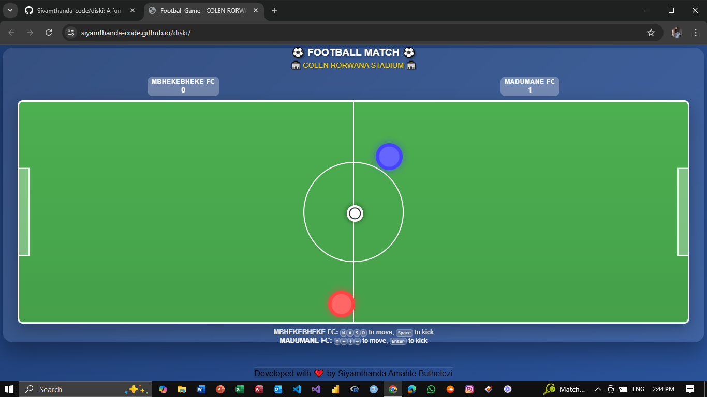

# ⚽ Football Game: Goalie-Diski

A fun and interactive 2-player football game featuring MBHEKEBHEKE FC vs MADUMANE FC at the iconic COLEN RORWANA STADIUM.

## 🎮 How to Play

### Objective
Score goals against your opponent while defending your own goal. The first player to reach 5 goals wins!

### Game Rules
- Each player controls one footballer on the field
- Players must position themselves adjacent to the ball (left, right, front, or back) to kick it
- Players cannot stand directly on top of the ball
- Scoring in your own goal results in an "OWN GOAL" for the opponent
- Rolling a 6 gives you an extra turn

### Controls

#### Player 1 (MBHEKEBHEKE FC - Red)
- **Movement**: `W` `A` `S` `D` keys
- **Kick**: `Spacebar` (hold to charge power)

#### Player 2 (MADUMANE FC - Blue)
- **Movement**: `Arrow Keys` (↑ ← ↓ →)
- **Kick**: `Enter` (hold to charge power)

### Mobile Controls
On mobile devices, touch controls appear at the bottom of the screen:
- Directional buttons for movement
- Dedicated KICK button for each player

## 🌟 Game Features

### Gameplay
- **Realistic Physics**: Ball bounces off players and walls naturally
- **Collision Detection**: Players can't move through each other
- **Power Kicking**: Hold kick button to charge shot power
- **Own Goal Detection**: Alerts when a player scores in their own goal
- **Smooth Movement**: Small, realistic steps for better control

### Visual Design
- **Responsive Field**: Adapts to different screen sizes
- **Team Colors**: MBHEKEBHEKE FC (Red) vs MADUMANE FC (Blue)
- **Stadium Atmosphere**: COLEN RORWANA STADIUM branding
- **Modern UI**: Glassmorphism effects and smooth animations
- **Power Meter**: Visual feedback for kick strength

### Technical Features
- **No External Dependencies**: Pure HTML, CSS, and JavaScript
- **Cross-Platform**: Works on desktop and mobile devices
- **Touch Support**: Optimized for mobile gameplay
- **Smooth Performance**: 60fps gameplay with efficient collision detection
- **Responsive Design**: Scales perfectly to any screen size

## 🏟️ Stadium Information

**Location**: COLEN RORWANA STADIUM  
**Teams**: MBHEKEBHEKE FC vs MADUMANE FC  
**Capacity**: Virtual stadium with optimal viewing angles  
**Pitch Dimensions**: 3:1 aspect ratio for perfect gameplay

## 🛠️ Technical Details

### Browser Compatibility
- Chrome, Firefox, Safari, Edge
- Mobile browsers (iOS Safari, Chrome Mobile)
- No additional plugins required

### Performance Optimizations
- Efficient collision detection algorithm
- Smooth 60fps animation loop
- Minimal memory footprint
- Optimized for both desktop and mobile

### Code Structure
- **HTML**: Semantic structure with accessibility in mind
- **CSS**: Modern styling with CSS variables and flexbox
- **JavaScript**: Clean, modular code with game loop architecture
- **No Frameworks**: Vanilla JavaScript for maximum compatibility

## 🎯 Tips for Players

1. **Positioning**: Always approach the ball from the sides, not directly on top
2. **Defense**: Use your player to block opponents and protect your goal
3. **Shooting**: Charge your kicks for more powerful shots
4. **Passing**: Use the walls for rebounds and unexpected passes
5. **Own Goals**: Be careful when defending near your own goal!

## 🤝 Contributing

This game was developed as a fun project to showcase web development capabilities. If you'd like to contribute or suggest improvements, feel free to create an issue or submit a pull request.

## 📱 Mobile Support

The game is fully optimized for mobile devices:
- Touch controls automatically appear on mobile
- Responsive design ensures perfect field visibility
- Performance optimized for mobile processors
- No horizontal scrolling required

## 🎨 Visual Assets

- **Player Models**: Simple but effective circular designs with team colors
- **Ball Design**: Classic football with realistic physics
- **Field**: Professional football pitch with proper markings
- **UI Elements**: Modern glassmorphism design with smooth animations

## 🔧 Customization

You can easily customize:
- Team names and colors
- Stadium name
- Goal limit (currently 5)
- Player movement speed
- Ball physics parameters
- Field dimensions

## 📄 License

This project is open source and available under the MIT License.

## 🙏 Credits

Developed with ❤️ by Siyamthanda Amahle Buthelezi

Special thanks to the football community for inspiration and to everyone who tested and provided feedback on the game.

---

**Enjoy the game and may the best team win! ⚽🏆**
